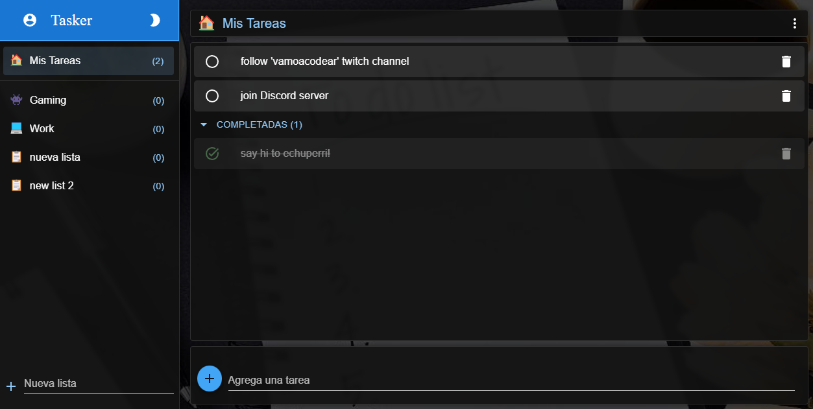
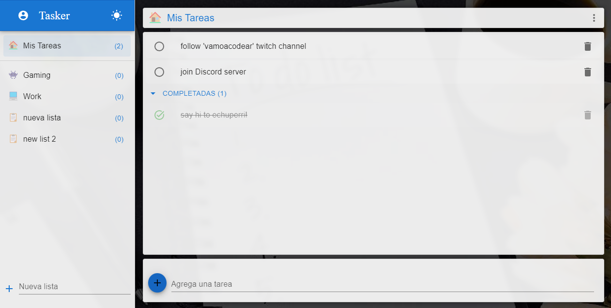
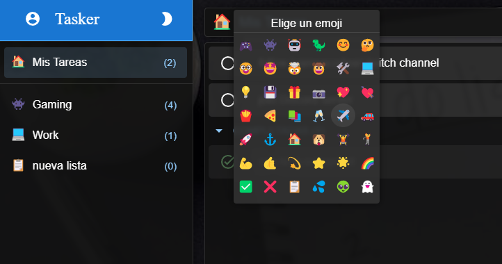

# Todo App

## Table of contents

- [Overview](#overview)
  - [Screenshot](#screenshot)
  - [Links](#links)
  - [Built with](#built-with)

## Overview

A Todo App inspired by "MS Todo" app, using React.js, Redux Toolkit and Material UI for designs. 
Firebase was used for databases and authentication handling.
Hope you like it!

### Screenshots

### Link

- Live Site URL: https://tasker-iota.vercel.app/

### Built with

- React.js 
- Redux Toolkit
- Material UI
- Firebase Auth
- Firebase Firestore
- Eslint 
